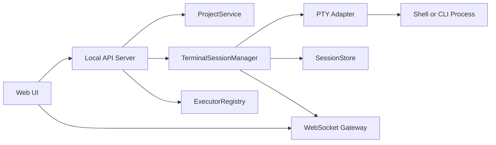
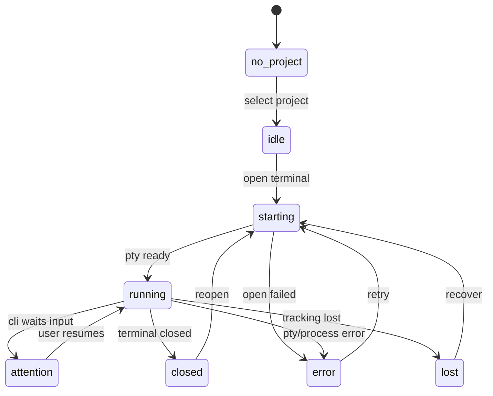

# SimpleKanban 准备文档（prepare）

## 1. 项目背景

### 1.1 参考项目：vibekanban
GitHub 上的 `vibekanban` 核心解决了以下问题：

1. 通过网页看板观察自己的 LLM CLI 正在处理任务的状态，同时可以直接在看板上和 CLI 互动。
2. 登录账号后提供服务器服务，因此可以实现多人协作、远程控制 vibe 任务。
3. 为了协作，它主要采用 `worktree` 形式进行任务管理。

### 1.2 当前痛点
虽然 `vibekanban` 本身设计没有明显问题，但我的主要开发场景是 Unity 游戏模块开发，这带来几个实际问题：

- Unity 对 `worktree` 支持并不友好。
- 游戏开发中经常需要“做一点 -> 立刻验证表现 -> 再继续”，流程更偏本地高频迭代。
- 如果先按完整协作框架推进，很容易提前陷入大框架、复杂状态和过度抽象，影响核心能力落地。

因此，这次准备从最核心功能开始，先做一个**本地优先**、**单机优先**、**适合 Unity 工作流**的 `TaskCard 管理器` 原型。

---

## 2. 需求整理

### 2.1 长期目标需求
后续完整产品希望支持：

- `Project - Workspace - TaskCard` 的任务管理结构。
- 类似 `Obsidian Canvas` 的无限画布，用于创建 TaskCard 流程图。
- 无限画布中的 `Group` 分组能力：
  - 可以在画布上圈定一块区域；
  - 区域内 Card 自动带上 Group 标记。
- 类似 Jira 的按状态查看 Task 能力。
- TaskCard 之间依赖关系查看。
- TaskCard 的 Tag 分组。
- TaskCard 可以直接拉起具体操作，例如执行某个 LLM CLI、Unity 工具脚本、构建脚本、测试脚本。
  - 这是当前最核心的能力。

### 2.2 当前真实需求澄清
经过讨论，当前阶段的核心需求并不是“单纯拉起一个外部 CLI 窗口”，而是：

**在网页中提供一套尽量等价于本地 terminal CLI 的完整交互能力。**

这意味着系统至少要支持：

- 在指定项目目录中启动一个终端会话。
- 在网页中实时查看终端输出。
- 在网页中向终端输入内容。
- 支持交互式 CLI 的常见行为：
  - 参数输入
  - 选项选择
  - 文件或目录参数传入
  - 持续会话而不是一次性命令
- 后续一个 `TaskCard` 可以关联多个“可执行内容”。

### 2.3 当前 v1 目标
本阶段只做最小闭环，先验证“本地项目 -> 网页终端会话 -> 完整 CLI 交互 -> 状态可见”是否稳定。

### 2.4 v1 页面元素
页面上至少包含：

1. 当前工程文件夹展示。
2. `选择工程` 按钮。
3. `创建 / 恢复终端会话` 按钮。
4. 一个网页终端区域，用于承载真实 CLI 交互。
5. 一个状态区，用于追踪终端会话状态。
6. 一个简单的运行器选择入口，用于选择当前会话使用什么执行器。

### 2.5 v1 非目标
本阶段明确**不做**以下内容：

- 不做账号系统。
- 不做多人协作。
- 不做远程服务器。
- 不做 `worktree` 管理。
- 不做 TaskCard 画布。
- 不做 Group 区域分组。
- 不做 Jira 风格状态看板。
- 不做依赖图。
- 不做 Tag 视图。
- 不做复杂任务编排。
- 不做完整的任务模板市场。

这些能力保留为后续迭代目标，但不进入当前里程碑的验收范围。

---

## 3. 核心判断

### 3.1 是否直接采用 vibekanban 架构
结论：**不直接照搬 vibekanban 架构，但要吸收它“会话管理”和“网页观察/控制 CLI”的核心思想。**

### 3.2 当前阶段的关键转向
本项目在 v1 阶段，应该从“启动外部 terminal 并聚焦窗口”转向“网页托管终端会话”。

也就是说：

- 真实核心不是 `open terminal window`
- 真实核心是 `host terminal session`

### 3.3 为什么要优先做网页终端
因为你真正需要的是：

- 常规命令输入
- 持续会话
- 交互式 CLI 支持
- 参数与文件路径输入
- 后续可以和 `TaskCard` 做绑定

如果使用网页终端：

- 不需要依赖外部 terminal 聚焦能力
- 会话状态与输出更容易统一管理
- 刷新页面后更容易恢复会话
- 更适合将来一个 TaskCard 对接多个执行入口

### 3.4 为什么不能只用普通 stdin/stdout 管道
很多 CLI 是否启用交互模式，取决于它是否运行在真实终端环境中。

如果只用普通重定向管道，会遇到这些问题：

- 某些 CLI 不认为自己在终端里运行
- 交互式选择器无法正常工作
- 颜色输出、光标移动、多行重绘可能异常
- 类似 prompt、选择菜单、全屏/半屏交互表现不完整

因此，真正需要的是：

**PTY / Pseudoterminal 能力，而不是简单进程管道。**

---

## 4. v1 设计原则

- **本地优先**：服务运行在本机，不依赖远程账号体系。
- **单机优先**：先支持单人、单机、单项目、单终端会话。
- **终端优先**：先稳定做出网页终端，而不是外部 terminal 聚焦。
- **后端持有能力**：项目目录、终端会话、执行器、状态追踪都由后端负责。
- **前端保持轻量**：页面主要负责展示、输入、参数辅助和状态反馈。
- **先打通闭环，再扩展模型**：先稳定跑通终端会话，再往 TaskCard 方向生长。
- **为未来扩展预留执行器模型**：后续一个 TaskCard 可以挂多个执行入口。

---

## 5. v1 推荐技术选型

### 5.1 首推方案
如果网页终端是核心功能，推荐优先采用：

### 后端
- `Node.js`
- `Fastify` 或 `Express`
- `WebSocket`
- `node-pty`
- Windows 下依赖 `ConPTY`

### 前端
- `React`
- `Vite`
- `TypeScript`
- `xterm.js`
- `xterm-addon-fit`
- `Zustand`

### 持久化
v1 建议先使用本地 JSON 文件保存少量状态，例如：

- 当前选中的工程路径
- 最近一次终端会话元信息
- 执行器配置
- 最近使用的 runner profile

后续进入 `TaskCard / Canvas / 依赖关系 / Tag` 阶段时，再升级为 `SQLite`。

### 5.2 为什么这里不首推 .NET
`.NET` 仍然是可行方案，但如果“网页终端”是当前第一核心功能，那么 `Node.js + node-pty + xterm.js` 的组合更成熟、更快落地。

原因：

- `xterm.js` 生态成熟
- `node-pty` 在网页终端场景下已经非常常见
- WebSocket 集成简单
- 对终端输入、输出、resize、关闭、持续会话的支持更直接

### 5.3 外部 terminal 仍然保留为扩展方向
后续仍然可以做：

- `managed terminal`：网页托管终端
- `external terminal`：外部独立终端

但 v1 优先 `managed terminal`。

---

## 6. v1 架构总览



### 6.1 模块说明

### Web UI
负责：

- 展示当前项目路径
- 触发“选择项目”
- 创建或恢复终端会话
- 展示终端输出
- 接收用户输入
- 发送终端 resize 事件
- 选择当前执行器

### Local API Server
负责：

- 提供 REST API
- 协调项目服务与终端会话服务
- 管理会话创建、恢复、销毁

### WebSocket Gateway
负责：

- 推送终端输出
- 推送终端状态变化
- 接收前端输入数据
- 接收前端终端尺寸变化

### ProjectService
负责：

- 获取当前项目
- 保存当前项目路径
- 项目切换规则

### TerminalSessionManager
负责：

- 创建终端会话
- 恢复终端会话
- 关闭终端会话
- 防止重复创建不必要的会话
- 管理当前项目对应的活跃终端会话

### PTY Adapter
负责：

- 对接系统级伪终端能力
- 在指定目录中启动 shell 或具体 CLI
- 处理输入、输出、resize、关闭

### ExecutorRegistry
负责：

- 维护可用执行器列表
- 抽象不同执行器的启动方式
- 为未来多执行入口保留扩展能力

### SessionStore
负责：

- 保存会话元信息
- 保存最近会话快照
- 支持页面刷新后恢复

---

## 7. 核心架构设计

### 7.1 从“Runner”升级为“Terminal + Executor”双层模型
当前需求下，不建议把系统理解成“点一个按钮就执行一个命令”。

更合理的模型是：

- **TerminalSession**：代表一个持续存在的终端会话
- **Executor**：代表一种可执行入口

两者关系：

- 一个终端会话可以进入 shell
- 也可以直接启动某个指定 CLI
- 后续一个 TaskCard 可以配置多个 Executor
- TaskCard 触发时，可以选择把命令注入已有终端，或者创建专属终端

### 7.2 为什么这个模型更适合未来 TaskCard
因为未来一个 TaskCard 很可能不止有一种执行方式，例如：

- `Codex CLI`
- `Claude Code`
- `Gemini CLI`
- `Unity Editor Batch Mode`
- `自定义 PowerShell 脚本`
- `测试脚本`
- `构建脚本`

因此，TaskCard 层不应该直接绑定某一个固定 CLI，而应该绑定一组可执行入口。

### 7.3 推荐抽象

#### TerminalSession
负责“容器”能力：

- cwd
- shell / command
- 输入输出
- resize
- 生命周期

#### Executor
负责“执行策略”能力：

- 名称
- 启动命令
- 默认参数
- 是否需要交互
- 是否需要文件参数
- 是否允许在共享终端中执行

#### TaskCardExecutorBinding
负责业务绑定：

- 某个 TaskCard 关联哪些可执行入口
- 哪个是默认入口
- 哪些参数需要用户补充

---

## 8. 数据模型建议

### 8.1 Project
```ts
Project {
  id: string
  name: string
  path: string
  createdAt: string
  updatedAt: string
}
```

### 8.2 Workspace（预留）
```ts
Workspace {
  id: string
  projectId: string
  name: string
  createdAt: string
  updatedAt: string
}
```

### 8.3 TaskCard（预留）
```ts
TaskCard {
  id: string
  projectId: string
  workspaceId?: string
  title: string
  description?: string
  status?: string
  tags: string[]
  dependencyIds: string[]
  executorBindingIds: string[]
  createdAt: string
  updatedAt: string
}
```

### 8.4 TerminalSession
```ts
TerminalSession {
  id: string
  projectId: string
  mode: "managed" | "external"
  shell: string
  cwd: string
  status: "idle" | "starting" | "running" | "attention" | "closed" | "error" | "lost"
  cols: number
  rows: number
  createdAt: string
  startedAt?: string
  endedAt?: string
  lastOutputAt?: string
}
```

### 8.5 ExecutorProfile
```ts
ExecutorProfile {
  id: string
  type: "shell" | "llm-cli" | "unity" | "script"
  name: string
  command: string
  argsTemplate: string[]
  interactive: boolean
  needsFileSelection: boolean
  needsDirectorySelection: boolean
  allowSharedSession: boolean
}
```

### 8.6 TaskCardExecutorBinding（预留）
```ts
TaskCardExecutorBinding {
  id: string
  taskCardId: string
  executorProfileId: string
  displayName: string
  defaultArgs?: Record<string, string>
  isDefault: boolean
}
```

---

## 9. v1 页面建议

### 9.1 页面最小组成
首页 / 主界面最少包含：

- 当前项目路径展示
- `选择项目` 按钮
- `创建 / 恢复终端` 按钮
- 执行器选择器
- 可选参数输入区
- 网页终端主区域
- 状态栏：
  - 当前会话状态
  - cwd
  - 执行器名称
  - 最后输出时间

### 9.2 页面草图
```text
+----------------------------------------------------------------+
| Current Project: D:\UnityProjects\DemoGame                    |
| [Select Project] [Open Terminal] [Reconnect]                   |
+----------------------------------------------------------------+
| Executor: [Codex CLI v]   Args: [.........................]    |
| File: [Select File]   Dir: [Select Dir]   [Run In Terminal]    |
+----------------------------------------------------------------+
| STATUS: running | CWD: D:\UnityProjects\DemoGame | PTY OK     |
+----------------------------------------------------------------+
| $ codex --project .                                             |
| > Analyzing Assets/Scripts/UI/...                               |
| > Updated InventoryController.cs                                |
| > Waiting for next instruction...                               |
| █                                                              |
+----------------------------------------------------------------+
```

### 9.3 按钮语义建议

#### `Open Terminal`
- 如果当前项目没有活跃终端，则创建新终端
- 如果已有活跃终端，则恢复并聚焦网页终端区域

#### `Run In Terminal`
- 将当前执行器和参数拼接成命令
- 注入当前终端会话执行

这样就把“终端容器”和“任务执行入口”分开了。

---

## 10. API 设计建议

### 10.1 REST API

#### `GET /api/health`
用于前端确认本地服务可用。

返回示例：
```json
{
  "ok": true,
  "app": "SimpleKanban",
  "version": "0.1.0"
}
```

#### `GET /api/project/current`
获取当前项目。

#### `POST /api/project/select`
选择并保存当前项目路径。

#### `GET /api/terminal/current`
获取当前项目的活跃终端会话。

返回示例：
```json
{
  "session": {
    "id": "term_001",
    "projectId": "proj_001",
    "mode": "managed",
    "cwd": "D:\\UnityProjects\\DemoGame",
    "status": "running",
    "cols": 120,
    "rows": 32,
    "lastOutputAt": "2026-03-07T14:11:03+08:00"
  }
}
```

#### `POST /api/terminal/open`
创建或恢复当前项目终端。

请求示例：
```json
{
  "mode": "managed",
  "shell": "powershell"
}
```

#### `POST /api/terminal/close`
关闭当前终端会话。

#### `POST /api/terminal/run`
将某个执行器命令注入当前终端执行。

请求示例：
```json
{
  "executorProfileId": "executor_codex",
  "args": {
    "prompt": "请检查 Inventory 模块",
    "file": "Assets/Scripts/UI/InventoryController.cs"
  }
}
```

#### `GET /api/executors`
获取当前系统支持的执行器列表。

#### `POST /api/executors/preview-command`
根据当前表单参数预览实际拼装出的命令。

这可以帮助后续做“参数辅助但不黑盒化”的体验。

### 10.2 WebSocket 事件
建议使用一个 `/ws/terminal` 通道。

#### 客户端发送：`terminal.input`
```json
{
  "sessionId": "term_001",
  "data": "dir\r"
}
```

#### 客户端发送：`terminal.resize`
```json
{
  "sessionId": "term_001",
  "cols": 120,
  "rows": 32
}
```

#### 服务端推送：`terminal.output`
```json
{
  "sessionId": "term_001",
  "data": "> Analyzing Assets...\r\n"
}
```

#### 服务端推送：`terminal.status`
```json
{
  "sessionId": "term_001",
  "status": "running"
}
```

#### 服务端推送：`terminal.snapshot`
```json
{
  "session": {
    "id": "term_001",
    "status": "running",
    "cwd": "D:\\UnityProjects\\DemoGame"
  }
}
```

#### 服务端推送：`terminal.exit`
```json
{
  "sessionId": "term_001",
  "exitCode": 0
}
```

#### 服务端推送：`terminal.error`
```json
{
  "sessionId": "term_001",
  "message": "PTY initialization failed"
}
```

---

## 11. 状态机定义

### 11.1 v1 建议状态枚举
建议最少支持：

- `no_project`
- `idle`
- `starting`
- `running`
- `attention`
- `closed`
- `error`
- `lost`

### 状态说明
- `no_project`：尚未选择工程目录
- `idle`：已选择工程，但尚未创建终端
- `starting`：终端创建中
- `running`：终端运行中
- `attention`：终端中的 CLI 正在等待用户进一步操作
- `closed`：终端已关闭
- `error`：终端创建失败或运行异常
- `lost`：后端无法确认终端状态，或连接状态丢失

### 11.2 状态流转


---

## 12. 目录选择、文件参数与外部 terminal 说明

### 12.1 目录选择
当前仍建议由后端负责项目目录管理，前端只负责发起操作和展示结果。

### 12.2 文件和目录参数输入
因为未来很多执行器都需要文件或目录参数，建议从 v1 开始就区分两种输入层：

#### 层 1：自由终端输入
用户像普通 terminal 一样手动输入命令。

#### 层 2：结构化参数辅助
网页表单帮助用户选择：

- 文件
- 目录
- prompt
- 运行器
- 预设参数

然后由系统拼接命令并注入终端。

这样既保留终端自由度，也方便 TaskCard 后续做结构化执行入口。

### 12.3 外部 terminal 的定位
外部 terminal 不删除，但当前降级为**后续扩展能力**。

建议未来作为：

- 调试模式
- 高兼容模式
- 特定终端习惯保留模式

而不是当前架构中心。

---

## 13. 验收标准（v1）

完成 v1 时，至少满足：

- 可以从网页中选择一个本地工程目录。
- 页面能展示当前工程目录。
- 可以创建一个网页托管终端会话。
- 用户可以在网页中直接输入终端内容。
- 用户可以在网页中看到实时终端输出。
- 页面刷新后，仍能恢复看到当前终端会话状态。
- 同一个项目不会误创建多个重复活跃终端。
- 终端正常关闭、异常退出、创建失败都能被状态区识别。
- 至少支持一种执行器通过网页参数区拼装命令并注入终端执行。

---

## 14. 里程碑建议

### M1：本地服务 + 项目选择
目标：

- 本地服务启动
- 前端页面能连接
- 项目目录可选择与保存
- 页面显示当前项目路径

### M2：网页终端最小闭环
目标：

- 创建一个 PTY 终端会话
- 前端展示终端输出
- 前端向终端写入输入
- 支持 resize

### M3：会话恢复与状态
目标：

- 页面刷新后恢复当前会话快照
- 终端状态可见
- 终端生命周期可追踪

### M4：执行器模型
目标：

- 增加 `ExecutorProfile`
- 增加参数辅助区
- 支持将执行器命令注入终端

### M5：向 TaskCard 过渡
目标：

- 保留 `TaskCard -> ExecutorBinding -> TerminalSession` 绑定结构
- 为后续画布与任务图准备执行层内核

---

## 15. 后续演进路线

建议路线：

- `v1`：单机、单项目、单网页终端、单执行器注入
- `v1.5`：单机、多项目、终端列表、多执行器
- `v2`：引入 TaskCard
- `v3`：引入无限画布、依赖关系、Tag、状态视图
- `v4`：加入 external terminal 支持
- `v5`：视真实需求决定是否进入远程协作、多用户与服务器模式

---

## 16. 当前结论

本项目的正确起点不是复刻 `vibekanban`，而是：

- 参考它“网页观察 / 控制 CLI 会话”的思想；
- 去掉它围绕协作和 `worktree` 的前提；
- 先做一个适合 Unity 本地开发流程的网页终端内核；
- 再从 `Project -> Workspace -> TaskCard -> Executor -> TerminalSession` 逐步长出来。

当前 v1 的重点只有一句话：

**先稳定打通“选择项目 -> 创建网页终端 -> 完整 CLI 交互 -> 注入执行器命令 -> 恢复会话状态”这条最小闭环。**
